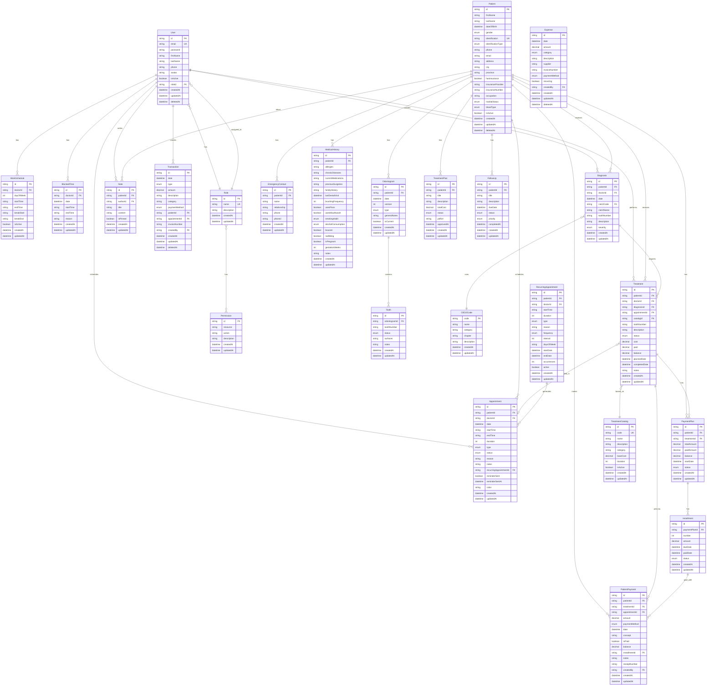
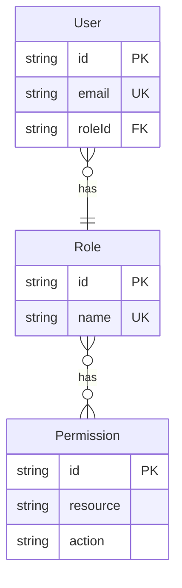
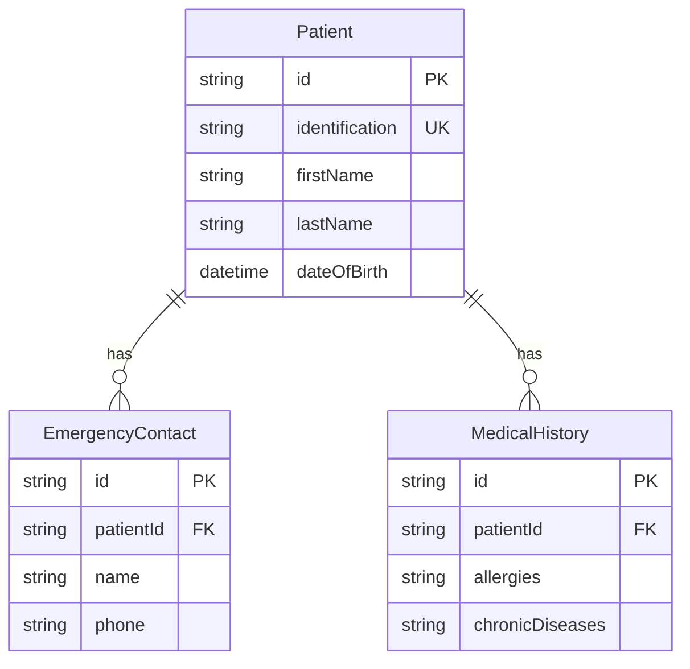
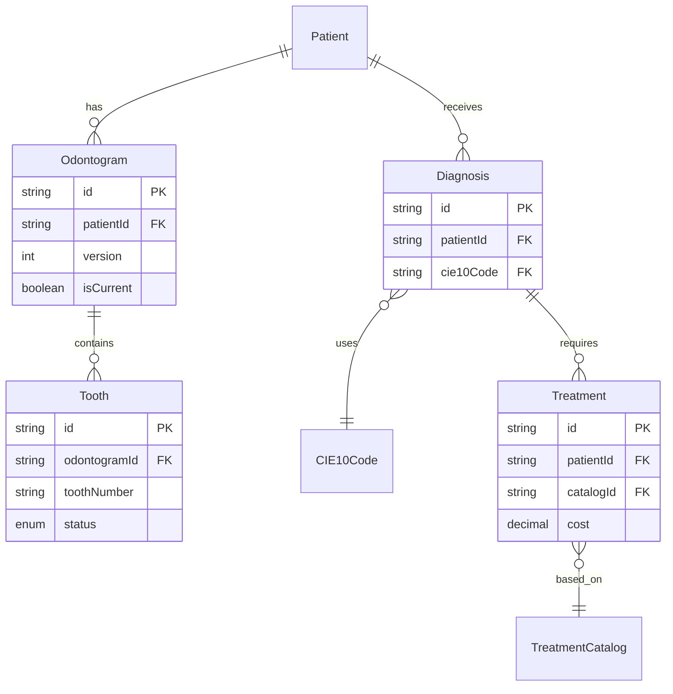
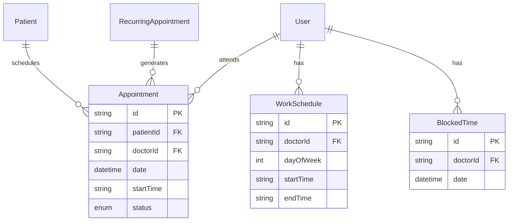
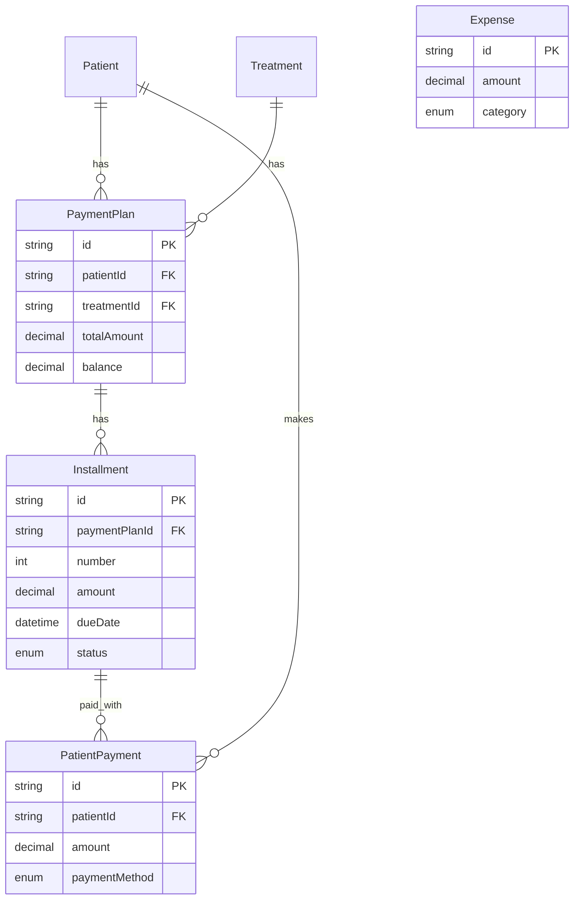

# Diagrama Entidad-Relación - Soldent

Este documento contiene el diagrama ER del esquema de base de datos.

## Diagrama ER Completo



## Diagrama por Módulos

### Módulo de Usuarios



### Módulo de Pacientes



### Módulo de Historia Clínica



### Módulo de Citas



### Módulo de Contabilidad



## Índices Principales

### Por Performance

```sql
-- Búsqueda de pacientes
CREATE INDEX idx_patients_identification ON patients(identification);
CREATE INDEX idx_patients_name ON patients(first_name, last_name);
CREATE INDEX idx_patients_phone ON patients(phone);

-- Agenda de citas
CREATE INDEX idx_appointments_date ON appointments(date);
CREATE INDEX idx_appointments_doctor ON appointments(doctor_id, date);
CREATE INDEX idx_appointments_status ON appointments(status);

-- Diagnósticos
CREATE INDEX idx_diagnoses_cie10 ON diagnoses(cie10_code);
CREATE INDEX idx_diagnoses_date ON diagnoses(date);

-- Contabilidad
CREATE INDEX idx_transactions_date ON transactions(date);
CREATE INDEX idx_transactions_type ON transactions(type);
CREATE INDEX idx_installments_due_date ON installments(due_date);
CREATE INDEX idx_installments_status ON installments(status);
```

### Unique Constraints

```sql
-- No duplicar identificación
UNIQUE(identification) ON patients

-- No duplicar email
UNIQUE(email) ON users

-- No duplicar código de tratamiento
UNIQUE(code) ON treatment_catalog

-- Solo un odontograma actual por paciente
UNIQUE(patient_id, is_current=true) ON odontograms (parcial)

-- No duplicar permisos
UNIQUE(resource, action) ON permissions
```

## Relaciones Cascade

### OnDelete: Cascade

Cuando se elimina el padre, se eliminan los hijos:

```
Patient → EmergencyContact
Patient → MedicalHistory
Patient → Odontogram
Patient → PaymentPlan
Odontogram → Tooth
PaymentPlan → Installment
User → WorkSchedule
User → BlockedTime
```

### OnDelete: Restrict (default)

No se puede eliminar si tiene hijos:

```
User (con Appointments)
TreatmentCatalog (con Treatments)
CIE10Code (con Diagnoses)
```

## Cardinalidades

### Uno a Muchos (1:N)

```
Patient → Appointments (un paciente, muchas citas)
User → Appointments (un doctor, muchas citas)
Patient → Odontograms (un paciente, muchos odontogramas)
Odontogram → Teeth (un odontograma, muchos dientes)
PaymentPlan → Installments (un plan, muchas cuotas)
```

### Muchos a Muchos (N:M)

```
Role ←→ Permission (a través de tabla implícita)
```

### Uno a Uno (1:1)

```
(Ninguna relación estrictamente 1:1 en este esquema)
```

## Soft Delete

Tablas con eliminación lógica (`deleted_at`):

- `users`
- `patients`
- `transactions`
- `expenses`

Query pattern:
```typescript
where: { deletedAt: null }
```

## Versionado

Tablas con versionado:

- `odontograms` (campo `version`, `is_current`)

Pattern:
```typescript
// Al actualizar, crear nueva versión
1. SET is_current = false WHERE id = current_id
2. INSERT new version WITH version = current_version + 1, is_current = true
```
